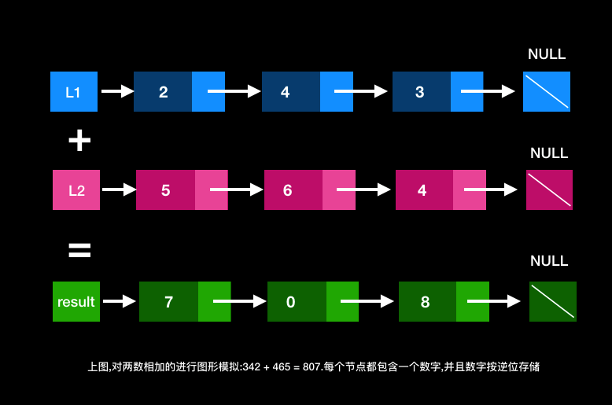

# BAT面试算法进阶\(1\)--两数之和

## 一.算法题

* **题目**

You are given two non-empty linked lists representing two non-negative integers. The digits are stored in reverse order and each of their nodes contain a single digit. Add the two numbers and return it as a linked list.

You may assume the two numbers do not contain any leading zero, except the number 0 itself.

* **Example**

> 输入: \(2 -&gt; 4 -&gt; 3\) + \(5 -&gt; 6 -&gt; 4\)  
>  输出: 7 -&gt; 0 -&gt; 8  
>  原因: 342 + 465 = 807.

## 二. 解决方案:

* 题目大意:给定2个非空链表来表示2个非负整数.位数按照逆序方式存储,它们的每个节点只存储单个数字,将两数相加返回一个新的链表.你可以假设除了数字0之外,这2个数字都不会以零开头.

### 2.1 思路

我们使用变量来跟踪进位,并从包含最低有效位的表头开始模拟逐位相加的过程.  




Snip20180810\_119.png

### 2.2 算法

就如同小学数学计算2个数相加一般,我们首先从低位有效位计算,也就是`L1`,`L2`的表头第一个位置开始相加.我们进行的十进制相加,所以当计算的结果大于9时,就会造成"溢出"的现象.例如`5+7=12`.此时,我们就会把当前为的值设置为2,但是溢出的位需要进位.那么则用`carry`存储,`carry = 1`.带入到下一次迭代计算中.进位的`carry`必定是0或者1.2个数累加,需要考虑进位问题.则采用一个变量来保存进位值.

### 2.3 伪代码

* 将当前节点初始化为返回列表的哑节点;
* 将进位carry设置为0;
* 将p,q分别指向为列表L1,L2的头部.
* 遍历列表L1,L2直到他们的尾端.
  * 将x设为节点的p的值.如果P已经到达L1的末尾,则将其值设置为0;
  * 将y设置为节点q的值,如果q已经到达L2的末尾,则将其值设置为0;
  * 求和 sum = x+y+carry;
  * 更新进位 carry = sum/10;
  * 创建一个新的节点,将其设置为下一个节点.并将当前节点移动到下一节点
  * 同时,将p,q移动到下一个节点位置.
* 检查carry 是否等于1,如果等于1则往列表中追加数字1到新节点中.
* 返回哑节点的下一个节点.

### 2.4 复杂度分析

* 时间复杂度: **`O(max(m,n))`**,假设m,n分别表示L1,l2长度.上面的算法最多重复**`max(m,n)`**次
* 空间复杂度:**`O(max(m,n))`**, 新列表的长度最多**`max(m,n)`**+1

### 2.5 参考代码

```c
#include 

struct ListNode {
    int val;
    struct ListNode *next;
};

struct ListNode* addTwoNumbers(struct ListNode * l1, struct ListNode *  l2) {
  
    struct ListNode *dummyHead = (struct ListNode *)malloc(sizeof(struct ListNode));
    struct ListNode *p = l1, *q = l2, *curr = dummyHead;
    int carry = 0;
    while (p != NULL || q != NULL) {
        int x = (p != NULL) ? p->val : 0;
        int y = (q != NULL) ? q->val : 0;
        
        int sum = carry + x + y;
        carry = sum / 10;
        
        curr->next = (struct ListNode *)malloc(sizeof(struct ListNode));
        curr->val = sum%10;
        curr = curr->next;
        if (p != NULL) p = p->next;
        if (q != NULL) q = q->next;
    }
    if (carry > 0) {
        curr->next = (struct ListNode *)malloc(sizeof(struct ListNode));
    }
    
    return curr;
}
```

### 

